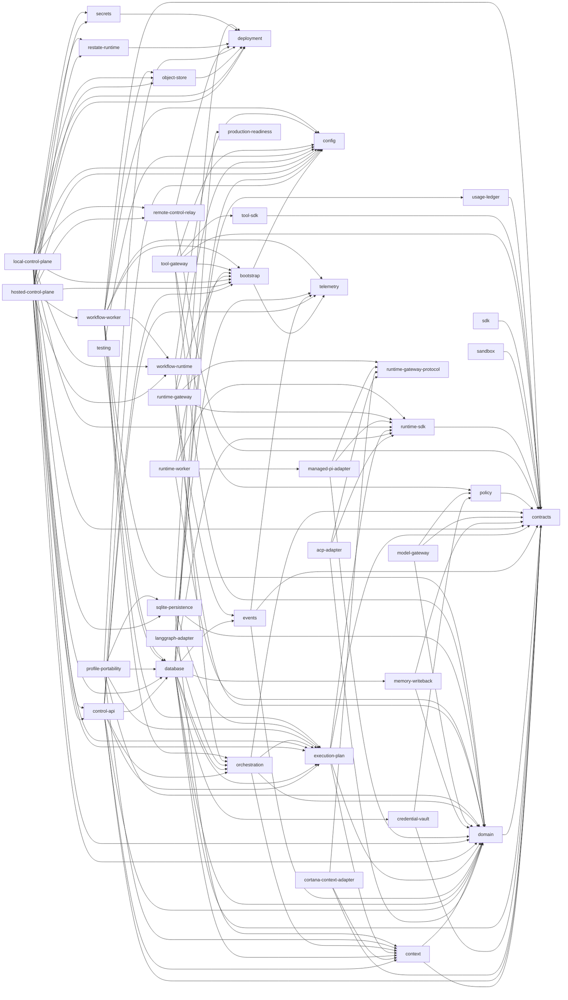
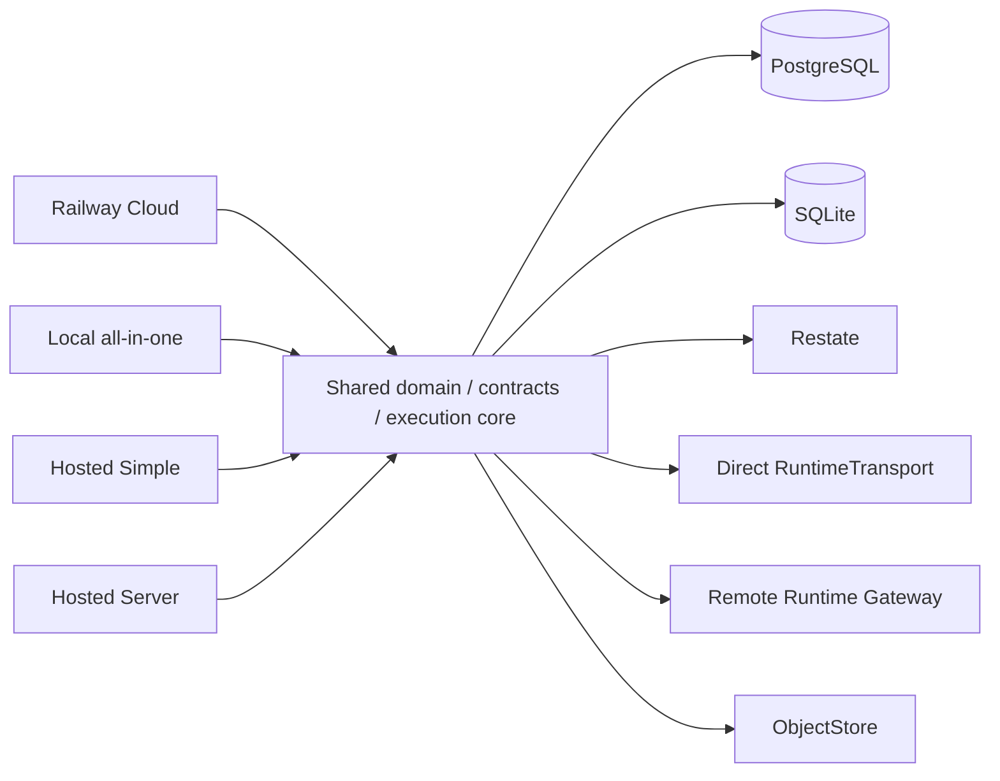

# Control Plane architecture, contracts, persistence, and production wiring audit

Generated from [control-plane-architecture.v1.json](./control-plane-architecture.v1.json) for candidate `d3e449471d02f791c52196ea296a5a8a653a4dd4`. Do not edit this report directly; run `bun run architecture:write`.

## Audit summary

- 41 workspace packages and applications.
- 11 public SDK operations.
- 4 deployment profiles.
- 12 persistence parity boundaries.
- 10 verified, 16 partially verified, 11 not implemented, and 0 superseded classified paths.

## Package dependency diagram

## Deployment composition diagram

## Package inventory

| Package                                                                          | Manifest / lock version | Layer                  | Kind        | Internal dependencies                                                                                                                                                                                                                                                                                                                                                                                                                                                  | External dependencies                                                                                                                                                                               | Exports                                                    |
| -------------------------------------------------------------------------------- | ----------------------- | ---------------------- | ----------- | ---------------------------------------------------------------------------------------------------------------------------------------------------------------------------------------------------------------------------------------------------------------------------------------------------------------------------------------------------------------------------------------------------------------------------------------------------------------------- | --------------------------------------------------------------------------------------------------------------------------------------------------------------------------------------------------- | ---------------------------------------------------------- |
| `@control-plane/acp-adapter` `packages/acp-adapter`                           | 1.2.0 / 1.1.0           | adapter-infrastructure | package     | `@control-plane/domain` `@control-plane/runtime-gateway-protocol` `@control-plane/runtime-sdk`                                                                                                                                                                                                                                                                                                                                                                   | `zod`                                                                                                                                                                                               | `.`                                                        |
| `@control-plane/bootstrap` `packages/bootstrap`                               | 1.2.0 / 1.2.0           | adapter-infrastructure | package     | `@control-plane/config` `@control-plane/telemetry`                                                                                                                                                                                                                                                                                                                                                                                                                  | —                                                                                                                                                                                                   | `.`                                                        |
| `@control-plane/config` `packages/config`                                     | 1.3.0 / 1.2.0           | core-port              | package     | —                                                                                                                                                                                                                                                                                                                                                                                                                                                                      | `zod`                                                                                                                                                                                               | `.`                                                        |
| `@control-plane/context` `packages/context`                                   | 1.3.0 / 1.3.0           | core-port              | package     | `@control-plane/contracts` `@control-plane/domain`                                                                                                                                                                                                                                                                                                                                                                                                                  | `zod`                                                                                                                                                                                               | `.`                                                        |
| `@control-plane/contracts` `packages/contracts`                               | 1.5.0 / 1.5.0           | core-port              | package     | —                                                                                                                                                                                                                                                                                                                                                                                                                                                                      | `zod`                                                                                                                                                                                               | `.`                                                        |
| `@control-plane/control-api` `apps/control-api`                               | 1.3.0 / 1.2.1           | composition-root       | application | `@control-plane/bootstrap` `@control-plane/config` `@control-plane/context` `@control-plane/contracts` `@control-plane/database` `@control-plane/domain` `@control-plane/execution-plan` `@control-plane/orchestration` `@control-plane/telemetry`                                                                                                                                                                                             | `@fastify/helmet` `@nestjs/common` `@nestjs/core` `@nestjs/platform-fastify` `@nestjs/swagger` `class-transformer` `class-validator` `fastify` `reflect-metadata` `rxjs` | —                                                          |
| `@control-plane/cortana-context-adapter` `packages/cortana-context-adapter`   | 1.1.0 / 1.1.0           | adapter-infrastructure | package     | `@control-plane/context` `@control-plane/contracts` `@control-plane/runtime-gateway-protocol`                                                                                                                                                                                                                                                                                                                                                                    | `zod`                                                                                                                                                                                               | `.`                                                        |
| `@control-plane/credential-vault` `packages/credential-vault`                 | 1.1.0 / 1.1.0           | adapter-infrastructure | package     | `@control-plane/contracts` `@control-plane/policy`                                                                                                                                                                                                                                                                                                                                                                                                                  | `zod`                                                                                                                                                                                               | `.`                                                        |
| `@control-plane/database` `packages/database`                                 | 1.7.0 / 1.6.0           | adapter-infrastructure | package     | `@control-plane/config` `@control-plane/context` `@control-plane/contracts` `@control-plane/credential-vault` `@control-plane/domain` `@control-plane/events` `@control-plane/execution-plan` `@control-plane/memory-writeback` `@control-plane/orchestration` `@control-plane/production-readiness` `@control-plane/runtime-sdk` `@control-plane/usage-ledger`                                                                       | `drizzle-orm` `postgres`                                                                                                                                                                         | `.` `./migration` `./testing`                        |
| `@control-plane/deployment` `packages/deployment`                             | 1.1.0 / 1.0.0           | core-port              | package     | —                                                                                                                                                                                                                                                                                                                                                                                                                                                                      | —                                                                                                                                                                                                   | `.`                                                        |
| `@control-plane/domain` `packages/domain`                                     | 1.5.0 / 1.5.0           | core-port              | package     | `@control-plane/contracts`                                                                                                                                                                                                                                                                                                                                                                                                                                             | `zod`                                                                                                                                                                                               | `.`                                                        |
| `@control-plane/events` `packages/events`                                     | 1.3.0 / 1.3.0           | core-port              | package     | `@control-plane/contracts` `@control-plane/domain` `@control-plane/telemetry`                                                                                                                                                                                                                                                                                                                                                                                    | `zod`                                                                                                                                                                                               | `.`                                                        |
| `@control-plane/execution-plan` `packages/execution-plan`                     | 1.2.0 / 1.2.0           | core-port              | package     | `@control-plane/context` `@control-plane/contracts` `@control-plane/domain` `@control-plane/runtime-sdk`                                                                                                                                                                                                                                                                                                                                                      | `zod`                                                                                                                                                                                               | `.` `./testing`                                         |
| `@control-plane/hosted-control-plane` `apps/hosted-control-plane`             | 1.1.0 / 1.0.0           | composition-root       | application | `@control-plane/bootstrap` `@control-plane/config` `@control-plane/control-api` `@control-plane/database` `@control-plane/deployment` `@control-plane/domain` `@control-plane/execution-plan` `@control-plane/object-store` `@control-plane/remote-control-relay` `@control-plane/restate-runtime` `@control-plane/secrets` `@control-plane/workflow-runtime` `@control-plane/workflow-worker`                                     | —                                                                                                                                                                                                   | —                                                          |
| `@control-plane/langgraph-adapter` `packages/langgraph-adapter`               | 1.1.0 / 1.1.0           | adapter-infrastructure | package     | `@control-plane/orchestration` `@control-plane/telemetry`                                                                                                                                                                                                                                                                                                                                                                                                           | `@langchain/langgraph` `@langchain/langgraph-checkpoint-postgres` `zod`                                                                                                                       | `.`                                                        |
| `@control-plane/local-control-plane` `apps/local-control-plane`               | 1.1.0 / 1.0.0           | composition-root       | application | `@control-plane/bootstrap` `@control-plane/config` `@control-plane/contracts` `@control-plane/control-api` `@control-plane/deployment` `@control-plane/domain` `@control-plane/execution-plan` `@control-plane/object-store` `@control-plane/remote-control-relay` `@control-plane/restate-runtime` `@control-plane/runtime-sdk` `@control-plane/secrets` `@control-plane/sqlite-persistence` `@control-plane/workflow-runtime` | `@nestjs/common` `@restatedev/restate-server` `fastify`                                                                                                                                       | —                                                          |
| `@control-plane/managed-pi-adapter` `packages/managed-pi-adapter`             | 1.2.0 / 1.1.0           | adapter-infrastructure | package     | `@control-plane/domain` `@control-plane/runtime-gateway-protocol` `@control-plane/runtime-sdk`                                                                                                                                                                                                                                                                                                                                                                   | `zod`                                                                                                                                                                                               | `.`                                                        |
| `@control-plane/memory-writeback` `packages/memory-writeback`                 | 1.1.0 / 1.1.0           | adapter-infrastructure | package     | `@control-plane/contracts` `@control-plane/domain`                                                                                                                                                                                                                                                                                                                                                                                                                  | `zod`                                                                                                                                                                                               | `.`                                                        |
| `@control-plane/model-gateway` `packages/model-gateway`                       | 1.1.0 / 1.1.0           | adapter-infrastructure | package     | `@control-plane/contracts` `@control-plane/domain` `@control-plane/policy`                                                                                                                                                                                                                                                                                                                                                                                       | `zod`                                                                                                                                                                                               | `.`                                                        |
| `@control-plane/object-store` `packages/object-store`                         | 1.2.0 / 1.1.1           | adapter-infrastructure | package     | `@control-plane/deployment`                                                                                                                                                                                                                                                                                                                                                                                                                                            | `@aws-sdk/client-s3`                                                                                                                                                                                | `.`                                                        |
| `@control-plane/orchestration` `packages/orchestration`                       | 1.1.0 / 1.1.0           | core-port              | package     | `@control-plane/context` `@control-plane/contracts` `@control-plane/domain` `@control-plane/execution-plan`                                                                                                                                                                                                                                                                                                                                                   | `zod`                                                                                                                                                                                               | `.`                                                        |
| `@control-plane/policy` `packages/policy`                                     | 1.2.0 / 1.2.0           | core-port              | package     | `@control-plane/contracts`                                                                                                                                                                                                                                                                                                                                                                                                                                             | `zod`                                                                                                                                                                                               | `.`                                                        |
| `@control-plane/production-readiness` `packages/production-readiness`         | 1.1.1 / 1.1.1           | adapter-infrastructure | package     | —                                                                                                                                                                                                                                                                                                                                                                                                                                                                      | `zod`                                                                                                                                                                                               | `.`                                                        |
| `@control-plane/profile-portability` `packages/profile-portability`           | 1.1.0 / 1.0.0           | adapter-infrastructure | package     | `@control-plane/context` `@control-plane/database` `@control-plane/deployment` `@control-plane/domain` `@control-plane/execution-plan` `@control-plane/sqlite-persistence`                                                                                                                                                                                                                                                                              | `drizzle-orm` `zod`                                                                                                                                                                              | `.`                                                        |
| `@control-plane/remote-control-relay` `packages/remote-control-relay`         | 1.1.0 / 1.0.0           | adapter-infrastructure | package     | `@control-plane/contracts` `@control-plane/deployment`                                                                                                                                                                                                                                                                                                                                                                                                              | `@hpke/core` `@hpke/dhkem-x25519` `zod`                                                                                                                                                       | `.`                                                        |
| `@control-plane/restate-runtime` `packages/restate-runtime`                   | 1.1.0 / 1.0.0           | adapter-infrastructure | package     | `@control-plane/deployment`                                                                                                                                                                                                                                                                                                                                                                                                                                            | —                                                                                                                                                                                                   | `.`                                                        |
| `@control-plane/runtime-gateway` `apps/runtime-gateway`                       | 1.2.0 / 1.2.0           | composition-root       | application | `@control-plane/bootstrap` `@control-plane/config` `@control-plane/domain` `@control-plane/events` `@control-plane/runtime-gateway-protocol` `@control-plane/runtime-sdk`                                                                                                                                                                                                                                                                               | —                                                                                                                                                                                                   | —                                                          |
| `@control-plane/runtime-gateway-protocol` `packages/runtime-gateway-protocol` | 1.2.0 / 1.2.0           | adapter-infrastructure | package     | —                                                                                                                                                                                                                                                                                                                                                                                                                                                                      | `zod`                                                                                                                                                                                               | `.` `./fixtures` `./schema/gateway-envelope.v1.json` |
| `@control-plane/runtime-sdk` `packages/runtime-sdk`                           | 1.5.0 / 1.4.0           | core-port              | package     | `@control-plane/contracts`                                                                                                                                                                                                                                                                                                                                                                                                                                             | `zod`                                                                                                                                                                                               | `.`                                                        |
| `@control-plane/runtime-worker` `apps/runtime-worker`                         | 1.4.0 / 1.3.0           | composition-root       | application | `@control-plane/bootstrap` `@control-plane/domain` `@control-plane/managed-pi-adapter` `@control-plane/runtime-sdk`                                                                                                                                                                                                                                                                                                                                           | `zod`                                                                                                                                                                                               | —                                                          |
| `@control-plane/sandbox` `packages/sandbox`                                   | 1.1.0 / 1.1.0           | adapter-infrastructure | package     | `@control-plane/contracts`                                                                                                                                                                                                                                                                                                                                                                                                                                             | `zod`                                                                                                                                                                                               | `.`                                                        |
| `@control-plane/sdk` `packages/control-sdk`                                   | 1.3.0 / 1.3.0           | adapter-infrastructure | package     | `@control-plane/contracts`                                                                                                                                                                                                                                                                                                                                                                                                                                             | —                                                                                                                                                                                                   | `.` `./testing`                                         |
| `@control-plane/secrets` `packages/secrets`                                   | 1.1.0 / 1.0.0           | adapter-infrastructure | package     | `@control-plane/deployment`                                                                                                                                                                                                                                                                                                                                                                                                                                            | —                                                                                                                                                                                                   | `.`                                                        |
| `@control-plane/sqlite-persistence` `packages/sqlite-persistence`             | 1.1.0 / 1.0.0           | adapter-infrastructure | package     | `@control-plane/context` `@control-plane/deployment` `@control-plane/domain` `@control-plane/execution-plan`                                                                                                                                                                                                                                                                                                                                                  | `drizzle-orm`                                                                                                                                                                                       | `.`                                                        |
| `@control-plane/telemetry` `packages/telemetry`                               | 1.2.1 / 1.2.1           | core-port              | package     | —                                                                                                                                                                                                                                                                                                                                                                                                                                                                      | `@opentelemetry/api` `@sentry/node`                                                                                                                                                              | `.`                                                        |
| `@control-plane/testing` `packages/testing`                                   | 1.1.2 / 1.1.2           | adapter-infrastructure | package     | `@control-plane/config` `@control-plane/database`                                                                                                                                                                                                                                                                                                                                                                                                                   | —                                                                                                                                                                                                   | `.` `./postgres`                                        |
| `@control-plane/tool-gateway` `apps/tool-gateway`                             | 1.2.1 / 1.2.1           | composition-root       | application | `@control-plane/bootstrap` `@control-plane/config` `@control-plane/contracts` `@control-plane/domain` `@control-plane/policy` `@control-plane/tool-sdk`                                                                                                                                                                                                                                                                                                 | `ajv`                                                                                                                                                                                               | —                                                          |
| `@control-plane/tool-sdk` `packages/tool-sdk`                                 | 1.2.0 / 1.2.0           | core-port              | package     | `@control-plane/contracts`                                                                                                                                                                                                                                                                                                                                                                                                                                             | `zod`                                                                                                                                                                                               | `.`                                                        |
| `@control-plane/usage-ledger` `packages/usage-ledger`                         | 1.1.0 / 1.1.0           | core-port              | package     | `@control-plane/contracts`                                                                                                                                                                                                                                                                                                                                                                                                                                             | `zod`                                                                                                                                                                                               | `.`                                                        |
| `@control-plane/workflow-runtime` `packages/workflow-runtime`                 | 1.1.0 / 1.0.0           | core-port              | package     | `@control-plane/config` `@control-plane/orchestration`                                                                                                                                                                                                                                                                                                                                                                                                              | `@restatedev/restate-sdk`                                                                                                                                                                           | `.`                                                        |
| `@control-plane/workflow-worker` `apps/workflow-worker`                       | 1.4.0 / 1.3.1           | composition-root       | application | `@control-plane/bootstrap` `@control-plane/config` `@control-plane/contracts` `@control-plane/database` `@control-plane/domain` `@control-plane/execution-plan` `@control-plane/object-store` `@control-plane/orchestration` `@control-plane/telemetry` `@control-plane/workflow-runtime`                                                                                                                                                   | `@restatedev/restate-sdk`                                                                                                                                                                           | —                                                          |

## Public operation reachability

| Operation                                                        | SDK / OpenAPI / controller                  | Classification     | Entrypoint-to-side-effect trace                                                                                                                                                                                                                                                                                                                                                                                                 | Assessment                                                                                                                                   | Gap                                                                                                                                                                                                         |
| ---------------------------------------------------------------- | ------------------------------------------- | ------------------ | ------------------------------------------------------------------------------------------------------------------------------------------------------------------------------------------------------------------------------------------------------------------------------------------------------------------------------------------------------------------------------------------------------------------------------- | -------------------------------------------------------------------------------------------------------------------------------------------- | ----------------------------------------------------------------------------------------------------------------------------------------------------------------------------------------------------------- |
| `authentication.verify` `POST /v1/authentication/verify`      | SDK: yes OpenAPI: yes Controller: no  | not_implemented    | auth: declared service bearer security service: no controller or application service persistence: unreachable execution: unreachable delivery: no response path cleanup: not applicable                                                                                                                                                                                                                          | The machine contract is published but no production composition can execute it.                                                              | [#188](https://github.com/0xPlayerOne/control-plane/issues/188) high; control-api; Implement and wire the authenticated operation or remove it from the supported SDK and OpenAPI surface.                  |
| `context-package.resolve` `POST /v1/context-packages/resolve` | SDK: yes OpenAPI: yes Controller: no  | not_implemented    | auth: declared service bearer security service: no controller or application service persistence: unreachable execution: unreachable delivery: no response path cleanup: not applicable                                                                                                                                                                                                                          | Concrete context repositories exist, but the public resolve operation is unreachable.                                                        | [#188](https://github.com/0xPlayerOne/control-plane/issues/188) high; control-api-context; Implement a scoped context resolution controller/service over the configured repository or remove the operation. |
| `execution.accept` `POST /v1/executions/accept`               | SDK: yes OpenAPI: yes Controller: yes | verified           | auth: service bearer with execution:accept scope service: ExecutionAcceptanceController -> DurableExecutionAcceptanceService persistence: CommandInboxRepository and ExecutionPlanRepository execution: Restate submission -> lifecycle activities -> RuntimeTransport delivery: acceptance status, result/error reference, and reconciliation state cleanup: workflow activity cleanup and composition shutdown | The operation is reachable when a supported composition injects durable services; the base module fails closed with an unavailable service.  | —                                                                                                                                                                                                           |
| `execution.validate` `POST /v1/executions/validate`           | SDK: yes OpenAPI: yes Controller: yes | verified           | auth: service bearer with execution:validate scope service: ExecutionValidationController -> DurableExecutionValidationService persistence: catalog, ProjectState, ContextPackage, and ExecutionPlan repositories execution: ExecutionPlan compiler and policy validation delivery: immutable ExecutionPlan public reference cleanup: no external side effect; composition closes repositories                   | The operation is reachable in Cloud, Local, Hosted Simple, and Hosted Server compositions; the base module fails closed when not configured. | —                                                                                                                                                                                                           |
| `external-session.get` `POST /v1/external-sessions/get`       | SDK: yes OpenAPI: yes Controller: yes | partially_verified | auth: service bearer with runtime:read scope service: RuntimeDiscoveryController -> RuntimeDiscoveryService persistence: RuntimeDiscoveryRepository (currently empty in production compositions) execution: read-only session lookup delivery: normalized external-session read model cleanup: no external side effect                                                                                           | The controller is reachable, but production compositions default to EmptyRuntimeDiscoveryRepository.                                         | [#188](https://github.com/0xPlayerOne/control-plane/issues/188) high; runtime-discovery; Wire concrete PostgreSQL and SQLite runtime/session discovery repositories in supported compositions.              |
| `external-session.list` `POST /v1/external-sessions/list`     | SDK: yes OpenAPI: yes Controller: yes | partially_verified | auth: service bearer with runtime:read scope service: RuntimeDiscoveryController -> RuntimeDiscoveryService persistence: RuntimeDiscoveryRepository (currently empty in production compositions) execution: read-only paginated session query delivery: paginated normalized external-session read models cleanup: no external side effect                                                                       | The controller is reachable, but production compositions default to EmptyRuntimeDiscoveryRepository.                                         | [#188](https://github.com/0xPlayerOne/control-plane/issues/188) high; runtime-discovery; Wire concrete PostgreSQL and SQLite runtime/session discovery repositories in supported compositions.              |
| `profile.resolve` `POST /v1/profiles/resolve`                 | SDK: yes OpenAPI: yes Controller: no  | not_implemented    | auth: declared service bearer security service: no controller or application service persistence: unreachable execution: unreachable delivery: no response path cleanup: not applicable                                                                                                                                                                                                                          | Catalog repositories and deterministic resolution exist, but the public operation is unreachable.                                            | [#188](https://github.com/0xPlayerOne/control-plane/issues/188) high; control-api-catalog; Implement scoped profile resolution over the configured catalog or remove the operation.                         |
| `project-state.resolve` `POST /v1/project-states/resolve`     | SDK: yes OpenAPI: yes Controller: no  | not_implemented    | auth: declared service bearer security service: no controller or application service persistence: unreachable execution: unreachable delivery: no response path cleanup: not applicable                                                                                                                                                                                                                          | ProjectState repositories exist in PostgreSQL and SQLite, but the public resolve operation is unreachable.                                   | [#188](https://github.com/0xPlayerOne/control-plane/issues/188) high; control-api-project-state; Implement scoped revision resolution over the configured ProjectState repository or remove the operation.  |
| `runtime-connection.get` `POST /v1/runtime-connections/get`   | SDK: yes OpenAPI: yes Controller: yes | partially_verified | auth: service bearer with runtime:read scope service: RuntimeDiscoveryController -> RuntimeDiscoveryService persistence: RuntimeDiscoveryRepository (currently empty in production compositions) execution: read-only connection lookup delivery: normalized runtime-connection read model cleanup: no external side effect                                                                                      | The controller is reachable, but production compositions default to EmptyRuntimeDiscoveryRepository.                                         | [#188](https://github.com/0xPlayerOne/control-plane/issues/188) high; runtime-discovery; Wire concrete PostgreSQL and SQLite runtime/session discovery repositories in supported compositions.              |
| `runtime-connection.list` `POST /v1/runtime-connections/list` | SDK: yes OpenAPI: yes Controller: yes | partially_verified | auth: service bearer with runtime:read scope service: RuntimeDiscoveryController -> RuntimeDiscoveryService persistence: RuntimeDiscoveryRepository (currently empty in production compositions) execution: read-only paginated connection query delivery: paginated normalized runtime-connection read models cleanup: no external side effect                                                                  | The controller is reachable, but production compositions default to EmptyRuntimeDiscoveryRepository.                                         | [#188](https://github.com/0xPlayerOne/control-plane/issues/188) high; runtime-discovery; Wire concrete PostgreSQL and SQLite runtime/session discovery repositories in supported compositions.              |
| `runtime.list` `POST /v1/runtimes/list`                       | SDK: yes OpenAPI: yes Controller: no  | not_implemented    | auth: declared service bearer security service: no controller or application service persistence: unreachable execution: unreachable delivery: no response path cleanup: not applicable                                                                                                                                                                                                                          | RuntimeConnection discovery routes exist, but the separate runtime.list contract is unreachable.                                             | [#188](https://github.com/0xPlayerOne/control-plane/issues/188) high; control-api-runtime; Implement the declared normalized runtime list or remove and migrate consumers to runtime-connection.list.       |

## Deployment profiles and infrastructure ports

| Profile       | Entrypoint / composition                                                                                                                                           | Classification     | Ports                                                                                                                                                                                                                                                                                                                                                                                                                               | Assessment                                                                                                                                                                                             | Gap                                                                                                                                                                                                                                                  |
| ------------- | ------------------------------------------------------------------------------------------------------------------------------------------------------------------ | ------------------ | ----------------------------------------------------------------------------------------------------------------------------------------------------------------------------------------------------------------------------------------------------------------------------------------------------------------------------------------------------------------------------------------------------------------------------------- | ------------------------------------------------------------------------------------------------------------------------------------------------------------------------------------------------------ | ---------------------------------------------------------------------------------------------------------------------------------------------------------------------------------------------------------------------------------------------------- |
| cloud         | `apps/control-api/src/index.ts + apps/workflow-worker/src/index.ts` `apps/control-api/src/cloud-composition.ts + apps/workflow-worker/src/cloud-composition.ts` | partially_verified | coordination: not-composed discovery: EmptyRuntimeDiscoveryRepository objectStore: R2ObjectStore observability: packages/telemetry persistence: PostgreSQL/Neon repositories processes: Railway service lifecycle runtimeTransport: DisabledCloudRuntime or CloudCertificationRuntime secrets: Railway environment; no SecretsProvider workflow: Restate                                                    | Repository-owned Railway, Neon, R2, and Restate wiring is real, but the execution runtime is disabled by default or staging-certification-only and shared deployment ports are not uniformly composed. | [#188](https://github.com/0xPlayerOne/control-plane/issues/188) critical; managed-cloud-runtime; Wire a production RuntimeTransport/activity implementation and concrete discovery/provider ports before claiming general Cloud execution readiness. |
| hosted-server | `apps/hosted-control-plane/src/index.ts` `apps/hosted-control-plane/src/composition.ts`                                                                         | not_implemented    | coordination: LocalCoordinationProvider discovery: StaticServiceDiscovery objectStore: FilesystemObjectStore or injected S3-compatible ObjectStore observability: BufferedObservabilityProvider persistence: PostgreSQL repositories processes: NodeProcessRuntimeProvider runtimeTransport: UnconfiguredHostedRuntime secrets: Composite environment/private-file SecretsProvider workflow: Remote Restate | Startup, migrations, readiness, persistence, storage, and Restate are wired, but every runtime dispatch fails HOSTED_RUNTIME_NOT_CONFIGURED.                                                           | [#188](https://github.com/0xPlayerOne/control-plane/issues/188) critical; hosted-runtime; Inject and certify a real remote RuntimeTransport/activity port before Hosted Server is a supported execution profile.                                     |
| hosted-simple | `apps/local-control-plane/src/index.ts --profile hosted-simple` `apps/local-control-plane/src/composition.ts`                                                   | partially_verified | coordination: LocalCoordinationProvider discovery: StaticServiceDiscovery objectStore: FilesystemObjectStore observability: BufferedObservabilityProvider persistence: SqlitePersistenceProvider processes: NodeProcessRuntimeProvider runtimeTransport: optional direct-local RuntimeAdapterWithTransport secrets: Composite environment/private-file SecretsProvider workflow: Local Restate              | The all-in-one profile uses the shared Local core and rejects remote-gateway transport, but the production entrypoint can start with runtime transport unconfigured.                                   | [#188](https://github.com/0xPlayerOne/control-plane/issues/188) high; hosted-simple-runtime; Make supported direct runtime wiring explicit in readiness and fail closed when execution is advertised without it.                                     |
| local         | `apps/local-control-plane/src/index.ts --profile local` `apps/local-control-plane/src/composition.ts`                                                           | partially_verified | coordination: LocalCoordinationProvider discovery: StaticServiceDiscovery objectStore: FilesystemObjectStore observability: BufferedObservabilityProvider persistence: SqlitePersistenceProvider processes: NodeProcessRuntimeProvider runtimeTransport: optional direct-local RuntimeAdapterWithTransport secrets: Composite environment/private-file SecretsProvider workflow: Local Restate              | The all-in-one profile shares domain, execution, and Restate code and prohibits remote-gateway transport, but the production entrypoint can report ready with runtime transport unconfigured.          | [#188](https://github.com/0xPlayerOne/control-plane/issues/188) high; local-runtime; Require or clearly classify direct RuntimeTransport readiness before accepting execution capability.                                                            |

## Ownership boundaries

| Entity                              | Authority                                                                               | Boundary                                                                                      | Evidence                                           |
| ----------------------------------- | --------------------------------------------------------------------------------------- | --------------------------------------------------------------------------------------------- | -------------------------------------------------- |
| AgentProfile/Skill                  | Control Plane domain catalog                                                            | Immutable versioned configuration; Agent HQ retains persistent Agent identity.                | `packages/domain/src/versioned-catalog.ts`         |
| Artifact                            | Agent HQ metadata; Control Plane ObjectStore for execution bytes                        | Opaque Artifact references and explicit promotion; Control Plane R2 credentials are separate. | `docs/architecture.md`                             |
| ContextPackage                      | Control Plane context compiler and repository                                           | Bounded immutable execution input distinct from provider corpus.                              | `packages/context/src/index.ts`                    |
| ContextProvider/MemoryWriteProposal | Provider owns corpus and memory; Control Plane owns selection and proposal coordination | Read and write grants remain separate; no direct provider database access.                    | `packages/context/src/provider.ts`                 |
| Execution/Attempt                   | Control Plane durable execution domain                                                  | Stable logical execution identity, distinct retry attempts and usage attribution.             | `packages/domain/src/execution-lifecycle.ts`       |
| ExecutionPlan                       | Control Plane compiler and immutable repositories                                       | Exact digests and policy/runtime/context pins precede acceptance.                             | `packages/execution-plan/src/index.ts`             |
| ProjectState                        | Control Plane domain                                                                    | Revisioned canonical state distinct from workflow history and checkpoints.                    | `packages/domain/src/project-state.ts`             |
| RuntimeConnection/ExternalSession   | Control Plane normalized inventory; RuntimeNode and harness own native identity/session | Capabilities and operations are negotiated; native identifiers remain opaque.                 | `packages/runtime-sdk/src/models.ts`               |
| Tool/Model/Sandbox                  | Control Plane policy and adapter registries                                             | Concrete providers remain behind tool, model, credential, and SandboxProvider interfaces.     | `tests/m7-tools-models-sandboxes.test.mjs`         |
| Usage/Evaluation                    | Control Plane                                                                           | Execution-attributed immutable usage and versioned evaluation evidence.                       | `packages/production-readiness/src/evaluations.ts` |
| events                              | Control Plane execution events; Agent HQ product events remain separate                 | Normalized append-only delivery with idempotency, replay, and redaction.                      | `packages/events/src/delivery.ts`                  |

## Contract, schema, and migration compatibility

| ID                                  | Representations                                                                                  | Classification     | Assessment                                                                                                                                                                                    | Gap                                                                                                                                                                                                                            |
| ----------------------------------- | ------------------------------------------------------------------------------------------------ | ------------------ | --------------------------------------------------------------------------------------------------------------------------------------------------------------------------------------------- | ------------------------------------------------------------------------------------------------------------------------------------------------------------------------------------------------------------------------------ |
| COMPAT-PUBLIC-OPERATIONS            | `TypeScript contracts` `SDK operation registry` `OpenAPI v2` `NestJS controllers`       | partially_verified | Contracts, SDK, and generated OpenAPI agree on 11 operations, but five advertised operations have no controller and OpenAPI generation does not inspect the runtime application.              | [#188](https://github.com/0xPlayerOne/control-plane/issues/188) high; public-contracts; Implement the five operations or remove them, and drift-gate OpenAPI against actual controller reachability.                           |
| COMPAT-PACKAGE-LOCK                 | `workspace package.json versions` `bun.lock workspace versions` `release manifest`         | partially_verified | Several workspace package versions differ from bun.lock workspace metadata even though frozen installation succeeds.                                                                          | [#192](https://github.com/0xPlayerOne/control-plane/issues/192) medium; release-engineering; Regenerate and review Bun workspace metadata without changing dependency policy, then add manifest-version drift enforcement.     |
| COMPAT-POSTGRES-MIGRATIONS          | `PostgreSQL Drizzle schema` `27 SQL migrations` `migration schema snapshot`                | verified           | Drizzle checks enforce current PostgreSQL schema and migration snapshot agreement.                                                                                                            | —                                                                                                                                                                                                                              |
| COMPAT-SQLITE-SCHEMA                | `SQLite Drizzle schema` `SCHEMA_VERSION=1` `imperative CREATE TABLE migration`             | partially_verified | The current schema is deterministic and tested, but SQLite has no forward migration history beyond version 1.                                                                                 | [#194](https://github.com/0xPlayerOne/control-plane/issues/194) medium; sqlite-persistence; Add explicit forward migration and rollback/forward-repair evidence before schema version 2.                                       |
| COMPAT-RUNTIME-MATRIX               | `runtime-sdk contracts` `runtime compatibility YAML` `certification check`                 | verified           | The compatibility check pins exact adapter, driver, transport, runtime, protocol, location, and profile combinations.                                                                         | —                                                                                                                                                                                                                              |
| COMPAT-EXPORTS                      | `package exports` `dependency manifests` `deep-import boundary checks`                     | verified           | Declared internal imports resolve through package exports; no undeclared deep imports were found.                                                                                             | —                                                                                                                                                                                                                              |
| COMPAT-DEPENDENCY-DIRECTION         | `workspace package manifests` `package exports` `Turborepo boundaries` `source imports` | verified           | Core port packages point inward and do not import applications or concrete provider packages; adapter packages depend on the shared deployment port contracts as intended.                    | —                                                                                                                                                                                                                              |
| COMPAT-CODEOWNERS                   | `package inventory` `repository ownership policy` `CODEOWNERS`                             | not_implemented    | The repository-wide CODEOWNERS rule still names the placeholder @OWNER and therefore provides no actionable review authority.                                                                 | [#192](https://github.com/0xPlayerOne/control-plane/issues/192) high; repository-governance; Replace the placeholder with the real owning user/team and verify protected-path review behavior.                                 |
| COMPAT-CORTANA-ADAPTER-REACHABILITY | `cortana-context-adapter package` `ContextProvider port` `deployment compositions`         | partially_verified | The adapter has contract tests but no supported composition root consumes it; live cross-product certification remains deferred.                                                              | [#188](https://github.com/0xPlayerOne/control-plane/issues/188) medium; context-integration; Wire provider-neutral adapter selection into supported compositions or explicitly classify the adapter as library-only until M12. |
| COMPAT-DOCUMENTATION                | `repository architecture` `normative Drive sources` `M11.1 requirement ledger`             | partially_verified | Repository architecture reflects Restate/Railway/profile portability, while six canonical Drive sources remain unavailable and several retrieved sources retain superseded topology language. | [#195](https://github.com/0xPlayerOne/control-plane/issues/195) high; documentation-governance; Reconcile canonical sources and preserve machine contract/schema ownership links.                                              |

## Persistence parity

| Boundary                 | PostgreSQL                                                                                        | SQLite                                                                          | Classification     | Assessment                                                                                                                    | Gap                                                                                                                                                                                                                          |
| ------------------------ | ------------------------------------------------------------------------------------------------- | ------------------------------------------------------------------------------- | ------------------ | ----------------------------------------------------------------------------------------------------------------------------- | ---------------------------------------------------------------------------------------------------------------------------------------------------------------------------------------------------------------------------- |
| PERSIST-BACKUP-RESTORE   | Operator/Neon backup plus profile-portability export/import; no PersistenceProvider backup method | Online backup/restore with SHA-256 and quick_check                              | partially_verified | SQLite has a concrete provider backup while PostgreSQL backup remains an external operational responsibility.                 | [#194](https://github.com/0xPlayerOne/control-plane/issues/194) medium; deployment-operations; Document and test the explicit PostgreSQL operator boundary with restore and forward-repair evidence.                         |
| PERSIST-CATALOG          | PostgresCatalogRepository                                                                         | SqliteVersionedCatalogRepository                                                | verified           | Both preserve immutable versions, lifecycle CAS, exact pins, and publish uniqueness.                                          | —                                                                                                                                                                                                                            |
| PERSIST-COMMAND-INBOX    | PostgresCommandAcceptanceRepository with typed columns and CAS                                    | SqliteCommandAcceptanceRepository over revisioned records                       | verified           | Both preserve duplicate replay, conflicting payload rejection, scope, retention input, and transition CAS.                    | —                                                                                                                                                                                                                            |
| PERSIST-CONTEXT-PACKAGE  | PostgresContextPackageRepository                                                                  | SqliteContextPackageRepository                                                  | verified           | Both retain immutable package identity and verify content digests on restore.                                                 | —                                                                                                                                                                                                                            |
| PERSIST-EXECUTION        | Typed execution and attempt tables with indexed lifecycle timestamps                              | SqliteExecutionRepository stores domain-validated JSON in revisioned records    | partially_verified | Core lifecycle semantics are shared, but SQLite lacks typed lifecycle columns/indexes and wider attempt/retry query evidence. | [#188](https://github.com/0xPlayerOne/control-plane/issues/188) medium; sqlite-persistence; Add parity tests for attempts, cancellation, timeout, retries, and lifecycle queries across both adapters.                       |
| PERSIST-EXECUTION-PLAN   | PostgresExecutionPlanRepository                                                                   | SqliteExecutionPlanRepository                                                   | verified           | Both preserve immutable plan identity, schema version, and digest conflict detection.                                         | —                                                                                                                                                                                                                            |
| PERSIST-MIGRATIONS       | 27 forward Drizzle migrations with schema drift check                                             | Single imperative schema version 1 migration                                    | partially_verified | Clean creation works in both profiles, but rollback and future SQLite upgrade paths are not implemented as migration streams. | [#194](https://github.com/0xPlayerOne/control-plane/issues/194) medium; database-migrations; Add versioned SQLite forward migrations and tested rollback/forward-repair procedures for both dialects.                        |
| PERSIST-OUTBOX-EVENTS    | Inbox, outbox, and execution-event tables with publication attempts                               | No concrete inbox/outbox or execution-event repository                          | not_implemented    | Local and Hosted Simple cannot claim persistence parity for durable event delivery.                                           | [#188](https://github.com/0xPlayerOne/control-plane/issues/188) high; sqlite-persistence-events; Implement SQLite inbox/outbox/event persistence or explicitly remove durable event delivery from supported Local semantics. |
| PERSIST-PROJECT-STATE    | Project state, revisions, mutations, and promotion proposal tables                                | Revisioned project state/history/mutation namespaces                            | partially_verified | State revision and mutation parity exists; SQLite has no concrete StatePromotionProposalRepository counterpart.               | [#188](https://github.com/0xPlayerOne/control-plane/issues/188) medium; sqlite-project-state; Add durable SQLite promotion proposal transitions and cross-adapter parity tests.                                              |
| PERSIST-RECONCILIATION   | PostgresReconciliationCheckpointRepository                                                        | No reconciliation checkpoint repository                                         | not_implemented    | SQLite profiles lack the durable reconciliation checkpoint surface available to server profiles.                              | [#188](https://github.com/0xPlayerOne/control-plane/issues/188) high; sqlite-reconciliation; Implement reconciliation checkpoint persistence and restart tests for SQLite profiles.                                          |
| PERSIST-RETENTION        | Typed retention expiry, soft deletion, and publication attempt metadata                           | Retention values may exist inside JSON but no indexed expiry/deletion lifecycle | not_implemented    | SQLite cannot enforce or sweep accepted retention/deletion semantics at the persistence boundary.                             | [#194](https://github.com/0xPlayerOne/control-plane/issues/194) high; sqlite-retention; Add indexed expiry/deletion metadata and deterministic sweep/recovery tests.                                                         |
| PERSIST-RUNTIME-COMMANDS | Runtime command, delivery attempt, receipt, and inventory checkpoint repositories                 | No equivalent runtime command or inventory repositories                         | not_implemented    | Direct Local transport tests command semantics in memory, but durable SQLite runtime-command persistence is absent.           | [#188](https://github.com/0xPlayerOne/control-plane/issues/188) high; sqlite-runtime; Implement durable SQLite runtime command/receipt/inventory storage or explicitly narrow Local recovery guarantees.                     |

## Lifecycle and concurrency coverage

| Concern                    | Assessment                                                                                                                | Evidence                                                                                                |
| -------------------------- | ------------------------------------------------------------------------------------------------------------------------- | ------------------------------------------------------------------------------------------------------- |
| approval-and-interaction   | Domain interactions and Restate waits are tested; profile reachability depends on real runtime wiring.                    | `tests/m3-durable-execution.test.mjs`                                                                   |
| cancellation-and-timeout   | Execution lifecycle and workflow tests cover transitions, deadlines, and cancellation propagation.                        | `packages/domain/src/execution-lifecycle.test.mjs`                                                      |
| idempotency-and-inbox      | Canonical payload hashes, replay, conflict, retention, and CAS are covered in PostgreSQL and SQLite command repositories. | `tests/m10-portability-conformance.test.mjs`                                                            |
| immutable-pinning          | Catalog, ContextPackage, ProjectState, policy, runtime, and ExecutionPlan references are digest/version pinned.           | `tests/m2-core-domain.test.mjs`                                                                         |
| outbox-and-event-delivery  | PostgreSQL delivery is durable and tested; SQLite parity is explicitly absent in PERSIST-OUTBOX-EVENTS.                   | `packages/events/src/delivery.test.mjs`                                                                 |
| reconciliation-and-restart | Restate submission uncertainty and remote command replay are covered; SQLite reconciliation persistence remains a gap.    | `tests/m9-production-hardening.test.mjs`                                                                |
| retention-and-deletion     | Operational limits and PostgreSQL metadata are present; SQLite indexed retention/deletion is absent.                      | `packages/config/src/operational.test.mjs`                                                              |
| state-machine-and-cas      | Domain transitions and compare-and-set semantics are tested for core PostgreSQL and SQLite repositories.                  | `packages/sqlite-persistence/src/repositories.test.mjs` `packages/database/src/integration.test.mjs` |

## Maintenance

Run `bun run architecture:check` after changing package manifests, public SDK operations, OpenAPI, controllers, composition roots, persistence adapters, or this audit. Run `bun run architecture:refresh` only after explicitly reviewing newly discovered package and operation drift.
