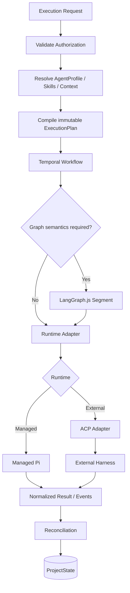
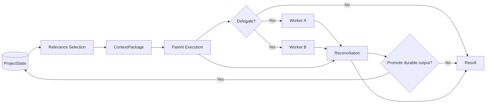
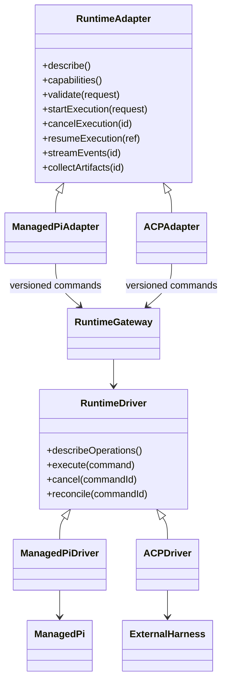
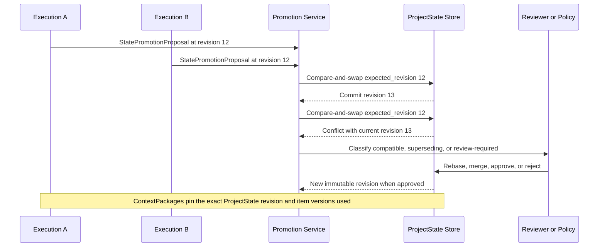

# Control Plane Diagram Sources

Status: Canonical repository source
Owner: Control Plane architecture
Last reviewed: 2026-08-23

These Mermaid definitions are the version-controlled source for the rendered diagrams in the canonical Google Docs.

## Editing and rendering rules

1. Edit the Mermaid definition here first.
2. Render and inspect the diagram before replacing the image in its owning document.
3. Keep the heading aligned with the owning Google Doc and figure purpose.
4. Do not hand-edit rendered diagram images.
5. Cross-repository definitions owned by Agent HQ remain in that repository's companion diagram-source file.

## Control Plane TDD: Execution & Orchestration

## Control Plane TDD: Context & Delegation Lifecycle

## Control Plane TDD: Runtime Adapter Architecture

## ProjectState Concurrency and Promotion

